# 🌿 The Potted Leaf

A full-stack e-commerce web application for purchasing indoor and outdoor plants with secure Stripe payments, JWT authentication, shopping cart, order management, stock management, and an admin dashboard.

---

## 📖 Overview

The Potted Leaf is a modern e-commerce platform built using **Spring Boot**, **React**, and **PostgreSQL**. Users can browse plants, manage their shopping cart, securely pay using Stripe Checkout, manage addresses, and track their orders.

An admin dashboard allows administrators to manage products, users, orders, and inventory.

---

# 📸 Application Screenshots

<table>
<tr>
<td>

### 🏠 Home

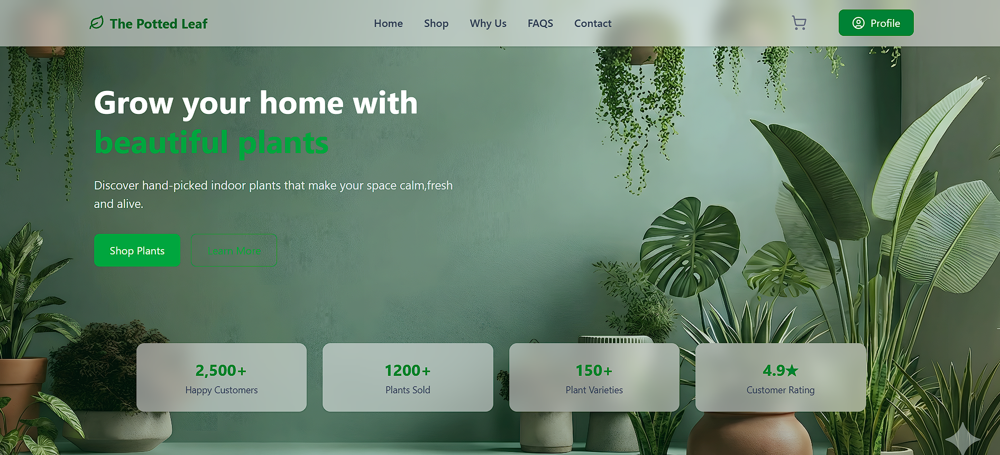

</td>

<td>

### 🌿 Plants

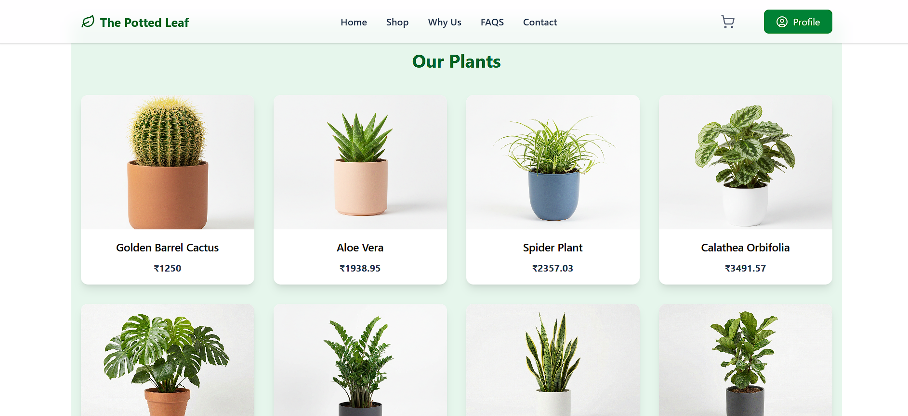

</td>
</tr>

<tr>
<td>

### 🌱 Product Details

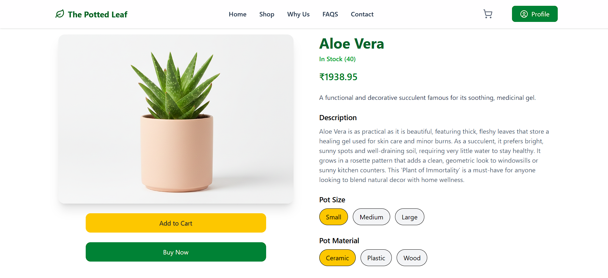

</td>

<td>

### 🛒 Cart

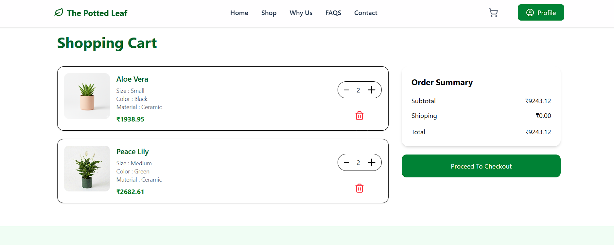

</td>
</tr>

<tr>
<td>

### 💳 Checkout

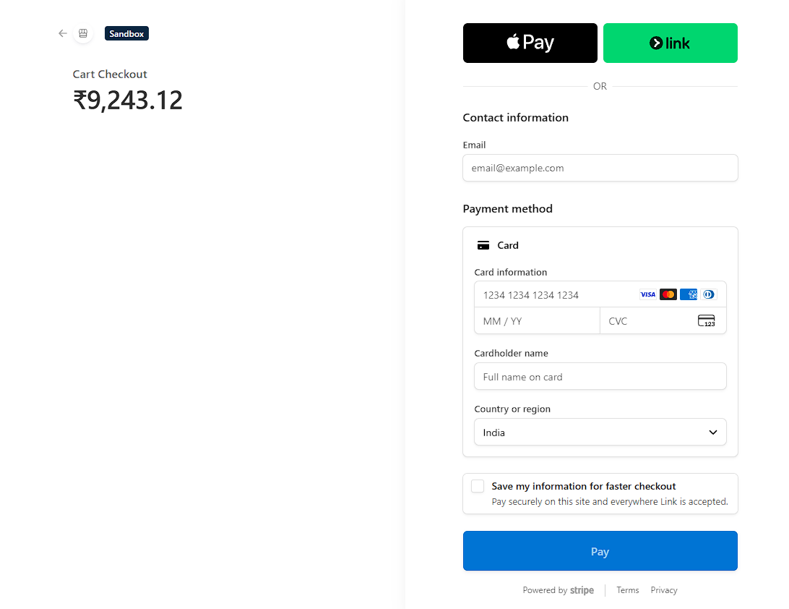

</td>

<td>

### 👤 Profile

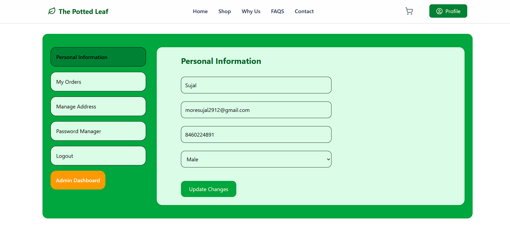

</td>
</tr>

<tr>
<td>

### 📦 Orders

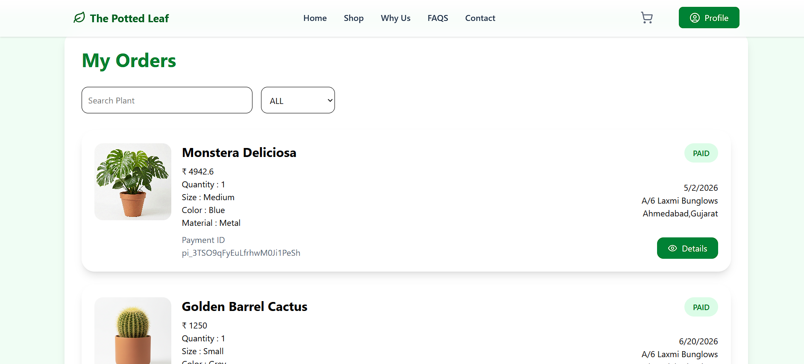

</td>

<td>

<tr>
<td colspan="2" align="center">

### 🚚 Order Tracking

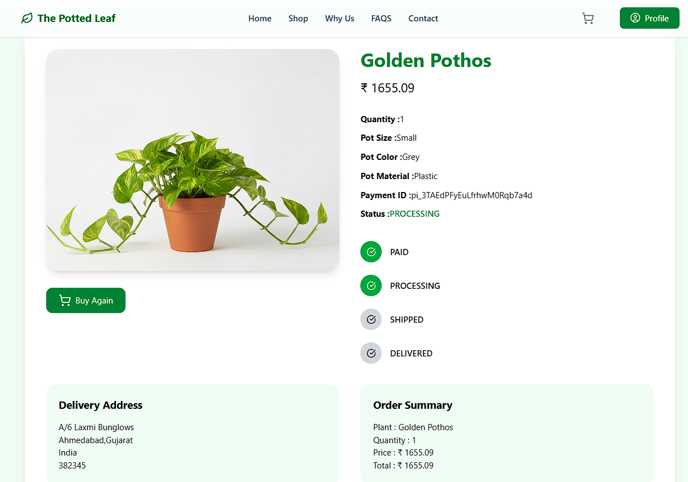

</td>
</tr>

### 👨‍💼 Admin Dashboard

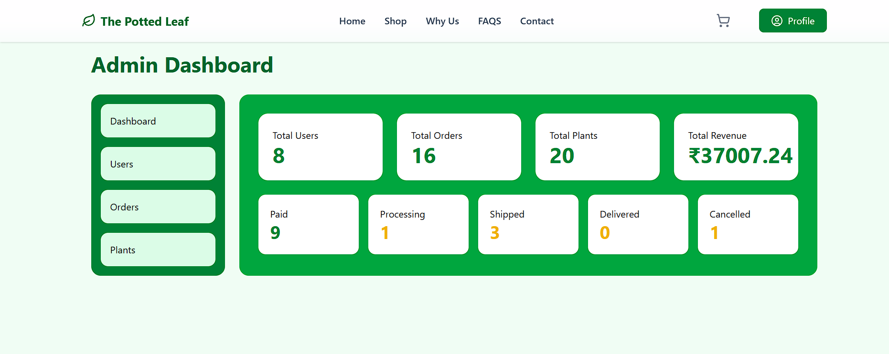

</td>
</tr>

<tr>
<td>

### 👥 Admin Users

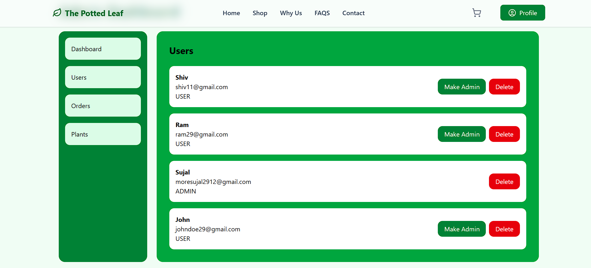

</td>

<td>

### 📋 Admin Orders

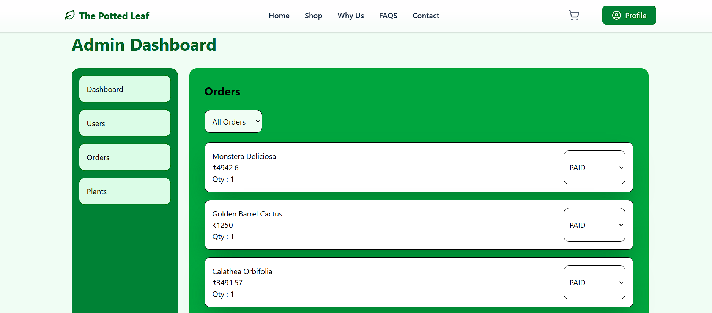

</td>
</tr>

<tr>
<td colspan="2" align="center">

### 🌿 Admin Plants

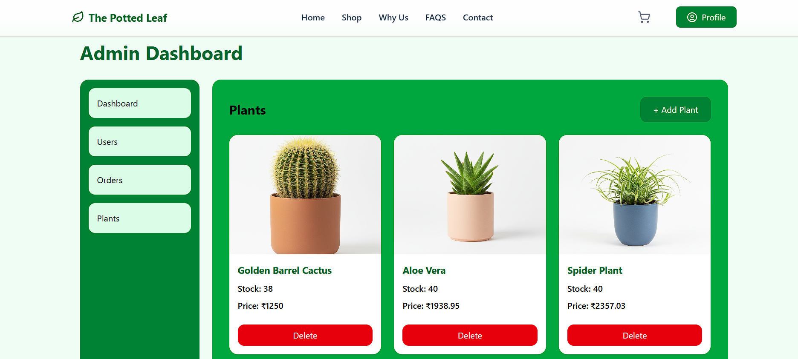

</td>
</tr>
</table>

---

# ✨ Features

## 👤 User Features

- User Registration & Login (JWT Authentication)
- Secure Role-Based Authorization
- Browse Plants
- Product Details Page
- Multiple Pot Sizes
- Multiple Pot Colors
- Multiple Pot Materials
- Shopping Cart
- Quantity Management
- Address Management
- Stripe Secure Checkout
- Buy Now Feature
- Order History
- Live Stock Availability
- Out of Stock Protection
- Responsive Design

---

## 🛒 Cart Features

- Add to Cart
- Remove from Cart
- Increase Quantity
- Decrease Quantity
- Automatic Total Calculation
- Address Selection before Checkout
- Stripe Payment Integration

---

## 💳 Payment Features

- Stripe Checkout Integration
- Stripe Webhooks
- Payment Verification
- Duplicate Payment Protection
- Automatic Order Creation
- Automatic Cart Clearing
- Automatic Stock Deduction

---

## 📦 Inventory Features

- Live Stock Quantity
- Out of Stock Message
- Remaining Stock Validation
- Prevent Purchase Beyond Available Quantity

---

## ⭐ Admin Features

- Dashboard Overview
- Total Users
- Total Orders
- Total Plants
- Total Revenue
- Orders by Status
- User Management
- Promote User to Admin
- Delete Users
- Manage Orders
- Update Order Status
- Plant Management
- Add New Plants
- Delete Plants
- Stock Management

---

# 🛠 Tech Stack

## Frontend

- React.js
- Tailwind CSS
- Framer Motion
- Axios
- React Router
- React Hot Toast

---

## Backend

- Java 21
- Spring Boot
- Spring Security
- Spring Data JPA
- Hibernate
- JWT Authentication
- Stripe API

---

## Database

- PostgreSQL

---

## Build Tools

- Maven
- Vite

---

## 📂 Project Structure

```text
ThePottedLeaf
│
├── Backend (Spring Boot)
│   │
│   ├── Config
│   │   ├── CorsConfig.java
│   │   ├── PasswordConfig.java
│   │   ├── SpringSecurity.java
│   │   └── StripeConfig.java
│   │
│   ├── Controller
│   │   ├── AddressController.java
│   │   ├── AdminController.java
│   │   ├── AuthController.java
│   │   ├── CartController.java
│   │   ├── OrderController.java
│   │   ├── PaymentController.java
│   │   ├── PlantController.java
│   │   ├── ReviewController.java
│   │   ├── UserController.java
│   │   └── WebhookController.java
│   │
│   ├── DTO
│   │   ├── AddressDTO.java
│   │   ├── AddToCartDTO.java
│   │   ├── ApiResponse.java
│   │   ├── AuthRequest.java
│   │   ├── CartCheckoutDTO.java
│   │   ├── CartItemResponseDTO.java
│   │   ├── ChangePasswordDTO.java
│   │   ├── DashboardStatsDTO.java
│   │   ├── OrderResponseDTO.java
│   │   ├── PlantResponseDTO.java
│   │   ├── ReviewDTO.java
│   │   ├── ReviewResponseDTO.java
│   │   ├── UpdateQuantityDTO.java
│   │   └── UserDTO.java
│   │
│   ├── Entities
│   │   ├── Address.java
│   │   ├── Cart.java
│   │   ├── CartItem.java
│   │   ├── Order.java
│   │   ├── Plant.java
│   │   ├── Review.java
│   │   └── User.java
│   │
│   ├── Filter
│   │   └── JwtFilter.java
│   │
│   ├── Repositories
│   │   ├── AddressRepository.java
│   │   ├── CartItemRepository.java
│   │   ├── CartRepository.java
│   │   ├── OrderRepository.java
│   │   ├── PlantRepository.java
│   │   ├── ReviewRepository.java
│   │   └── UserRepository.java
│   │
│   ├── Services
│   │   ├── AddressService.java
│   │   ├── AdminService.java
│   │   ├── CartService.java
│   │   ├── CustomUserDetails.java
│   │   ├── CustomUserDetailsServiceImpl.java
│   │   ├── OrderService.java
│   │   ├── PaymentService.java
│   │   ├── PlantService.java
│   │   ├── ReviewService.java
│   │   └── UserService.java
│   │
│   ├── Utils
│   │   └── JwtUtils.java
│   │
│   └── ThePottedLeafApplication.java
│
├── Frontend (React + Vite)
│   │
│   ├── api
│   │   └── axios.js
│   │
│   ├── assets
│   │   └── Images
│   │
│   ├── components
│   │   ├── AddressCard.jsx
│   │   ├── CartItem.jsx
│   │   ├── CartSummary.jsx
│   │   ├── FAQ.jsx
│   │   ├── Features.jsx
│   │   ├── Footer.jsx
│   │   ├── Header.jsx
│   │   ├── Hero.jsx
│   │   ├── Navbar.jsx
│   │   ├── OrderCard.jsx
│   │   ├── OrderTimeline.jsx
│   │   ├── ProductCard.jsx
│   │   ├── ProtectedRoute.jsx
│   │   ├── ReviewSection.jsx
│   │   └── WhyChoose.jsx
│   │
│   ├── context
│   │   ├── AuthContext.jsx
│   │   └── ThemeContext.jsx
│   │
│   ├── pages
│   │   ├── AdminDashboard.jsx
│   │   ├── Cancel.jsx
│   │   ├── Cart.jsx
│   │   ├── Checkout.jsx
│   │   ├── Home.jsx
│   │   ├── Login.jsx
│   │   ├── OrderDetails.jsx
│   │   ├── Orders.jsx
│   │   ├── PaymentSuccess.jsx
│   │   ├── ProductDetails.jsx
│   │   ├── Profile.jsx
│   │   └── Register.jsx
│   │
│   ├── App.jsx
│   ├── App.css
│   ├── index.css
│   ├── main.jsx
│   └── vite.config.js
│
├── images
│   ├── home.png
│   ├── product-details.png
│   ├── cart.png
│   ├── checkout.png
│   ├── profile.png
│   ├── orders.png
│   ├── admin-dashboard.png
│   └── ...
│
├── README.md
└── LICENSE
```

---

# 🗄️ Database Schema

```text
                               +----------------------+
                               |        User          |
                               +----------------------+
                               | id                   |
                               | name                 |
                               | email                |
                               | password             |
                               | role                 |
                               | contact              |
                               | gender               |
                               +----------+-----------+
                                          |
             +----------------------------+-----------------------------+
             |                            |                             |
             | 1:N                        | 1:1                         | 1:N
             |                            |                             |
             v                            v                             v

+----------------------+        +----------------------+       +----------------------+
|      Address         |        |        Cart          |       |        Order         |
+----------------------+        +----------------------+       +----------------------+
| id                   |        | id                   |       | id                   |
| type                 |        | user_id (FK)         |       | payment_id           |
| streetAddress        |        +----------+-----------+       | status               |
| city                 |                   |                   | quantity             |
| state                |                   | 1:N               | selectedSize         |
| zipCode              |                   |                   | selectedColor        |
| country              |                   |                   | selectedMaterial     |
| user_id (FK)         |                   v                   | orderDate            |
+----------------------+        +----------------------+       | user_id (FK)         |
                              |      CartItem        |       | plant_id (FK)        |
                              +----------------------+       | address_id (FK)      |
                              | id                   |       +----------+-----------+
                              | quantity             |                  |
                              | selectedSize         |                  |
                              | selectedColor        |                  |
                              | selectedMaterial     |                  |
                              | cart_id (FK)         |                  |
                              | plant_id (FK)        |                  |
                              +----------+-----------+                  |
                                         |                              |
                                         | N:1                          |
                                         |                              |
                                         +--------------+---------------+
                                                        |
                                                        v

                                           +---------------------------+
                                           |          Plant            |
                                           +---------------------------+
                                           | id                        |
                                           | name                      |
                                           | shortDescription          |
                                           | longDescription           |
                                           | sizes                     |
                                           | colors                    |
                                           | materials                 |
                                           | price                     |
                                           | stockQuantity             |
                                           | rating                    |
                                           | imageUrl                  |
                                           +-------------+-------------+
                                                         |
                              +--------------------------+------------------------+
                              |                                                   |
                              | 1:N                                               | 1:N
                              |                                                   |
                              v                                                   v

                    +----------------------+                        +----------------------+
                    |       Review         |                        |        Order         |
                    +----------------------+                        +----------------------+
                    | id                   |                        | references Plant     |
                    | rating               |                        +----------------------+
                    | comment              |
                    | createdAt            |
                    | user_id (FK)         |
                    | plant_id (FK)        |
                    +----------------------+
```

---

# 🔄 Application Flow

```
User Login

↓

Browse Plants

↓

Product Details

↓

Select

• Size
• Color
• Material

↓

Add To Cart
• Quantity

↓

Checkout

↓

Select Address

↓

Stripe Checkout

↓

Stripe Webhook

↓

Order Created

↓

Stock Updated

↓

Cart Cleared

↓

Order History
```

---

# 🔐 Authentication Flow

```
User Login

↓

Spring Security

↓

JWT Generated

↓

Frontend Stores Token

↓

Protected API Calls

↓

JWT Filter

↓

Authentication

↓

Controller Access
```

---

# 💳 Payment Flow

```
Checkout

↓

Stripe Checkout Session

↓

Stripe Hosted Page

↓

Payment Success

↓

Stripe Webhook

↓

Verify Signature

↓

Save Orders

↓

Reduce Stock

↓

Clear Cart
```

---

# 🚀 Installation

## Backend

```bash
git clone https://github.com/yourusername/the-potted-leaf.git

cd backend
```

Configure:

```
application.yml
```

Run

```bash
mvn spring-boot:run
```

---

## Frontend

```bash
cd frontend

npm install

npm run dev
```

---

# ⚙ Environment Variables

Backend

```
SPRING_DATASOURCE_URL

SPRING_DATASOURCE_USERNAME

SPRING_DATASOURCE_PASSWORD

JWT_SECRET

STRIPE_SECRET_KEY

STRIPE_WEBHOOK_SECRET
```

Frontend

```
VITE_API_URL

VITE_STRIPE_PUBLISHABLE_KEY
```

---

# 📈 Future Enhancements

- Product Wishlist
- Product Reviews with Images
- Product Recommendations
- Search Filters
- Sorting
- Pagination
- Sales Analytics
- Email Notifications
- Invoice Generation
- Deployment

---

# 👨‍💻 Author

**Sujal More**
- LinkedIn:<a href="https://www.linkedin.com/in/sujal-more-841575249">Sujal More</a>
- Email: moresujal2003@gmail.com
- Full Stack Developer (Java • Spring Boot • React)

---

# ⭐ If you like this project

Give it a ⭐ on GitHub!